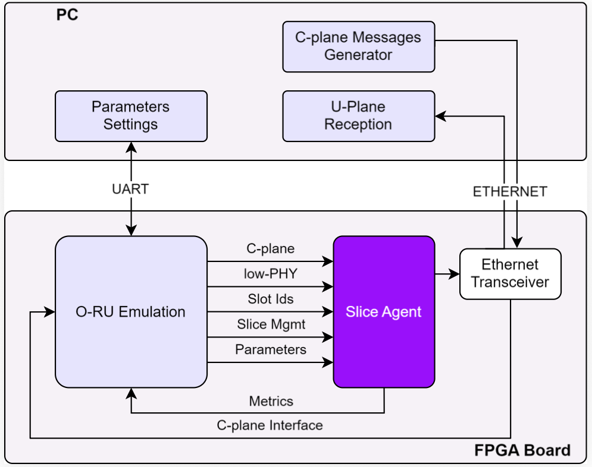
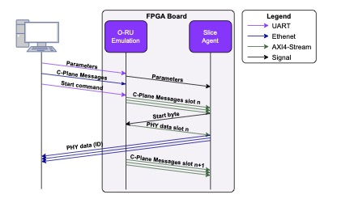

# Slice Agent: Identifying and Isolating Slices in Shared Open Radio Unit

This repository contains the prototype implementation and experimental artifacts of the paper:

**Slice Agent: Identifying and Isolating Slices in a Shared Open Radio Unit**

The project presents a hardware-based solution for identifying and isolating slices in a shared Open Radio Unit (O-RU) environment.

The prototype focuses on the **receiver pipeline scheme**, designed to meet the strict timing constraints of **5G New Radio (NR)** fronthaul communications.

---

# Overview

The Slice Agent is implemented on the **KCU105 platform**, a development board based on the **AMD Xilinx Kintex UltraScale FPGA**.

This platform was selected due to its capabilities for:

- massive parallel processing
- deterministic low latency
- real-time data processing
- efficient hardware acceleration

These characteristics make it suitable for implementing high-performance fronthaul processing functions.

---

# Prototype Architecture

The architecture of the Slice Agent prototype is shown in the figure below.

<p align="center">
  
</p>

<p align="center">
  <em>Figure 1 – Slice Agent prototype architecture.</em>
</p>

The system is composed of the following main components:

### FPGA Platform

The FPGA implements the **Slice Agent** and several supporting modules:

- O-RU emulation block
- scheduling and timing modules
- Ethernet interface
- UART configuration interface
- FIFO buffers

The Slice Agent receives control messages, processes scheduling information, and encapsulates uplink PHY data while identifying the correct network slice.

### O-RU Emulator

Since no functional open O-RU implementation was available as a base platform, an **O-RU emulation module** was implemented.

This block is responsible for:

- generating timing reference signals
- forwarding scheduling information
- synchronizing PHY data transmission

### Software Test Environment

A **Python-based software framework** was developed to emulate the behavior of:

- O-DU
- management plane

The software performs several functions:

- generation of configuration parameters
- creation of C-plane messages
- configuration of the FPGA through UART
- collection of execution metrics

The uplink user-plane data generated by the Slice Agent is captured using **Wireshark**, which provides built-in decoding support for the **eCPRI protocol**.

---

# Experimental Workflow

The interaction between the software test environment and the FPGA system is illustrated in the sequence diagram below.



The experiment follows a strict sequence of operations:

1. The Python test environment sends configuration parameters to the FPGA via UART.
2. Parameters include:
   - numerology
   - I/Q sample width
   - number of PRBs per Ethernet packet
   - symbol period
   - initial time-slot identifiers
3. These parameters are stored in a FIFO inside the FPGA.
4. C-plane messages are transmitted over Ethernet.
5. The O-RU emulator forwards these messages to the Slice Agent using an AXI4-Stream interface.
6. When the Slice Agent starts encapsulation, it signals the beginning of PHY data transmission.
7. The O-RU emulator then injects PHY data through AXI4-Stream.
8. The Slice Agent processes and encapsulates the data with slice identification.
9. Packets are transmitted through Ethernet and captured by the test environment.

---

# Test Configuration

All experiment parameters are generated by the **Test Cases module**, implemented in Python.

This module allows configuring:

- numerology
- bandwidth
- I/Q sample width
- number of slices
- uplink data time-domain allocation
- uplink data frequency-domain allocation
- jitter and latency conditions

This flexible configuration enables emulation of various **fronthaul scenarios** and slice configurations.

---

# Metrics

The Slice Agent is evaluated using three primary metrics.

## Processing Time

Measured in clock cycles.

Represents the time required for the Slice Agent to:

- receive scheduling information
- process the control message
- encapsulate PHY data
- transmit the Ethernet packet

This metric directly impacts system latency and throughput.

## Memory Occupation

Evaluates the amount of internal memory used by the Slice Agent, including:

- FIFO buffers
- internal storage structures

Efficient memory usage is important to avoid resource contention within the FPGA.

## FPGA Resource Utilization

Measured using FPGA synthesis reports.

The main hardware resources evaluated are:

- LUT
- Flip-Flops
- BRAM
- DSP blocks

These metrics allow evaluating the hardware efficiency of the design.

---

# Repository Structure

```
slice-agent-shared-oru/
│
├── fpga/        # Hardware implementation of the Slice Agent
│   └── ip_repo/ # Vivado IP blocks
│
├── software/    # Python test environment
├── docs/        # Architecture documentation
├── scripts/     # Automation scripts
├── data/        # Experiment configurations
└── results/     # Evaluation results
```
# Hardware Platform

- AMD Xilinx Kintex UltraScale FPGA
- KCU105 Development Board

---

# Tools

- Vivado
- Python
- Wireshark
- UART communication tools

---

# Citation

If you use this work, please cite:

```bibtex
@article{sliceagent2025,
  title={Slice Agent: Identifying and Isolating Slices in Shared Open Radio Unit},
  author={...},
  year={2025}
}
```

